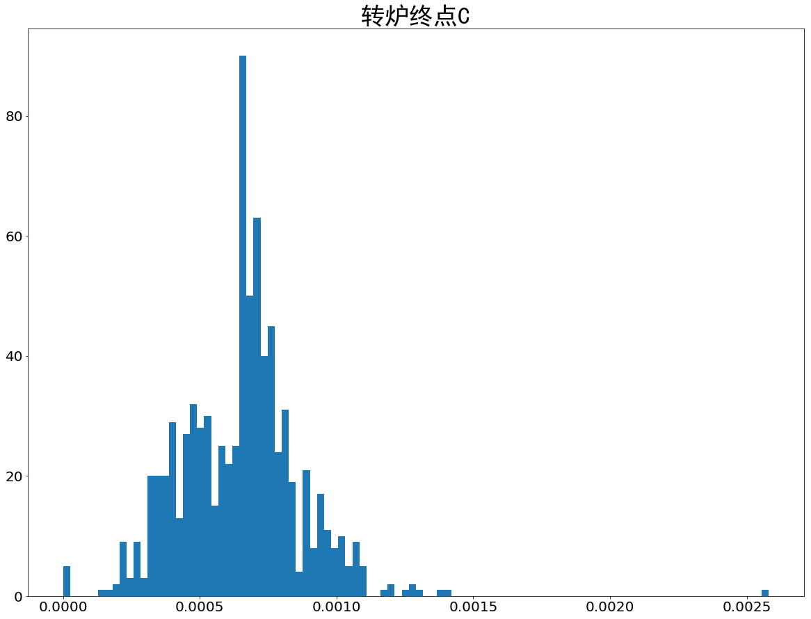

.. code:: ipython3

    import pandas as pd
    import matplotlib.pyplot as plt
    import numpy as np
    import pylab
    pylab.rcParams['figure.figsize'] = (20.0, 15.0)

计算收得率
----------

.. code:: ipython3

    data = pd.read_excel('data1.xlsx')
    # 计算加入的C、Mn元素质量、吸收质量、收得率
    data.drop(data[data['连铸正样C'].isnull()].index,inplace=True)
    c_t=['钒铁(FeV50-A)','钒铁(FeV50-B)','硅铝合金FeAl30Si25','硅锰面（硅锰渣）','硅铁(合格块)','硅铁FeSi75-B','石油焦增碳剂','锰硅合金FeMn64Si27(合格块)','锰硅合金FeMn68Si18(合格块)','碳化硅(55%)','硅钙碳脱氧剂']
    c_p=[0.0031,0.0031,0.00374,0.017,0.0006,0.0006,0.96,0.017,0.017,0.3,0.225692308]
    mn_t=['硅铝锰合金球','硅锰面（硅锰渣）','锰硅合金FeMn64Si27(合格块)','锰硅合金FeMn68Si18(合格块)']
    mn_p = [0.3,0.664,0.664,0.664]
    
    # 离群值处理
    # outs=['转炉终点温度', '转炉终点C', '转炉终点Mn', '转炉终点S', '转炉终点P',
    #        '转炉终点Si', '钢水净重', '连铸正样C', '连铸正样Mn', '连铸正样S', '连铸正样P', '连铸正样Si']
    # for out in outs:
    #     data.drop(data[(data[out]>(data[out].mean()+3*data[out].std()))|(data[out]<(data[out].mean()-3*data[out].std()))].index,inplace=True)
    # data.drop(data[(data['转炉终点C']>0.002)|(data['转炉终点C']<0.0001)].index,inplace=True) 
    # data.drop(data[(data['转炉终点C']>0.002)|(data['转炉终点C']<0.0001)].index,inplace=True) 
    data['加入C含量']=(data[c_t]*c_p).sum(axis=1)
    data['吸收C质量']=(data['连铸正样C']-data['转炉终点C'])*data['钢水净重']
    data['C收得率'] = data['吸收C质量']/data['加入C含量']
    data['加入Mn含量']=(data[mn_t]*mn_p).sum(axis=1)
    data['吸收Mn质量']=(data['连铸正样Mn']-data['转炉终点Mn'])*data['钢水净重']
    data['Mn收得率']=data['吸收Mn质量']/data['加入Mn含量']
    # data.to_excel('q1_1_收得率.xls',index=False)
    len(data)

.. parsed-literal::

    810

.. code:: ipython3

    data.isna().sum()

.. parsed-literal::

    炉号                       0
    钢种                       0
    钢号                       0
    转炉终点温度                   0
    转炉终点C                    1
    转炉终点Mn                 560
    转炉终点S                    1
    转炉终点P                  560
    转炉终点Si                   1
    钢水净重                     0
    连铸正样C                    0
    连铸正样Mn                   0
    连铸正样S                    0
    连铸正样P                    0
    连铸正样Si                   0
    连铸正样Ceq_val              0
    连铸正样Cr                   0
    连铸正样Ni_val               0
    连铸正样Cu_val               0
    连铸正样Nb_val             616
    连铸正样V_val                0
    连铸正样Alt_val              0
    连铸正样Als_val              0
    连铸正样Mo_val               0
    连铸正样Ti_val              10
    连铸正样N_val              810
    连铸正样O_val              810
    连铸正样B_val              739
    氮化钒铁FeV55N11-A           0
    低铝硅铁                     0
    钒氮合金(进口)                 0
    钒铁(FeV50-A)              0
    钒铁(FeV50-B)              0
    钒铁(FeV50-B).1            0
    硅铝钙                      0
    硅铝合金FeAl30Si25           0
    硅铝锰合金球                   0
    硅锰面（硅锰渣）                 0
    硅铁(合格块)                  0
    硅铁FeSi75-B               0
    石油焦增碳剂                   0
    锰硅合金FeMn64Si27(合格块)      0
    锰硅合金FeMn68Si18(合格块)      0
    碳化硅(55%)                 0
    硅钙碳脱氧剂                   0
    加入C含量                    0
    吸收C质量                    1
    C收得率                     1
    加入Mn含量                   0
    吸收Mn质量                 560
    Mn收得率                  560
    dtype: int64

.. code:: ipython3

    plt.grid()

::

    ---------------------------------------------------------------------------

    TypeError                                 Traceback (most recent call last)

    <ipython-input-38-e807c0287841> in <module>()
    ----> 1 plt.grid()
    

    TypeError: 'str' object is not callable

.. code:: ipython3

    h = data['转炉终点C'].hist(bins=100,)
    plt.xticks(fontsize=20)
    plt.yticks(fontsize=20)
    plt.title('转炉终点C',fontproperties="SimHei",fontsize=35)
    h.grid(False)

.. code:: ipython3

    # data.isnull().sum()

相关性分析
----------

.. code:: ipython3

    nume = ['转炉终点温度', '转炉终点C', '转炉终点S',
           '转炉终点Si', '钢水净重', 
    #         '连铸正样C', '连铸正样Mn', '连铸正样S', '连铸正样P', '连铸正样Si',
    #        '连铸正样Ceq_val', '连铸正样Cr', '连铸正样Ni_val', '连铸正样Cu_val', '连铸正样Nb_val',
    #        '连铸正样V_val', '连铸正样Alt_val', '连铸正样Als_val', '连铸正样Mo_val', '连铸正样Ti_val',
            '氮化钒铁FeV55N11-A', '低铝硅铁',
           '钒氮合金(进口)', '钒铁(FeV50-A)', '钒铁(FeV50-B)', '钒铁(FeV50-B).1', '硅铝钙',
           '硅铝合金FeAl30Si25', '硅铝锰合金球', '硅锰面（硅锰渣）', '硅铁(合格块)', '硅铁FeSi75-B',
           '石油焦增碳剂', '锰硅合金FeMn64Si27(合格块)', '锰硅合金FeMn68Si18(合格块)', '碳化硅(55%)',
           '硅钙碳脱氧剂','C收得率','Mn收得率']

.. code:: ipython3

    nm_df = data[nume].apply(lambda x: (x - np.min(x)) / (np.max(x) - np.min(x)))

.. code:: ipython3

    data[list(used.index)+['C收得率']].to_csv('C_train_data.csv',index=False)

.. code:: ipython3

    data# C相关系数矩阵
    c_corr = data[nume].corr()[['C收得率']]
    used = c_corr[(abs(c_corr['C收得率'])>0.15)]
    # c_corr.sort_values('C收得率',ascending=False)
    used

.. raw:: html

    

    
    <table border="1" class="dataframe">
      <thead>
        <tr style="text-align: right;">
          <th></th>
          <th>C收得率</th>
        </tr>
      </thead>
      <tbody>
        <tr>
          <th>转炉终点C</th>
          <td>-0.288815</td>
        </tr>
        <tr>
          <th>钢水净重</th>
          <td>0.502615</td>
        </tr>
        <tr>
          <th>低铝硅铁</th>
          <td>0.411273</td>
        </tr>
        <tr>
          <th>石油焦增碳剂</th>
          <td>-0.268498</td>
        </tr>
        <tr>
          <th>C收得率</th>
          <td>1.000000</td>
        </tr>
        <tr>
          <th>Mn收得率</th>
          <td>0.725349</td>
        </tr>
      </tbody>
    </table>
    

.. code:: ipython3

    # Mn相关系数矩阵
    c_corr = data[nume].corr()[['Mn收得率']]
    used = c_corr[(abs(c_corr['Mn收得率'])>0.15)]
    used.sort_values('Mn收得率')

.. raw:: html

    

    
    <table border="1" class="dataframe">
      <thead>
        <tr style="text-align: right;">
          <th></th>
          <th>Mn收得率</th>
        </tr>
      </thead>
      <tbody>
        <tr>
          <th>碳化硅(55%)</th>
          <td>-0.216302</td>
        </tr>
        <tr>
          <th>钒铁(FeV50-B).1</th>
          <td>-0.186182</td>
        </tr>
        <tr>
          <th>钒氮合金(进口)</th>
          <td>0.248616</td>
        </tr>
        <tr>
          <th>C收得率</th>
          <td>0.725349</td>
        </tr>
        <tr>
          <th>低铝硅铁</th>
          <td>0.940746</td>
        </tr>
        <tr>
          <th>钢水净重</th>
          <td>0.944048</td>
        </tr>
        <tr>
          <th>Mn收得率</th>
          <td>1.000000</td>
        </tr>
      </tbody>
    </table>
    

.. code:: ipython3

    data.head()

.. raw:: html

    

    
    <table border="1" class="dataframe">
      <thead>
        <tr style="text-align: right;">
          <th></th>
          <th>炉号</th>
          <th>钢种</th>
          <th>钢号</th>
          <th>转炉终点温度</th>
          <th>转炉终点C</th>
          <th>转炉终点Mn</th>
          <th>转炉终点S</th>
          <th>转炉终点P</th>
          <th>转炉终点Si</th>
          <th>钢水净重</th>
          <th>...</th>
          <th>硅铝锰合金球</th>
          <th>硅锰面（硅锰渣）</th>
          <th>硅铁(合格块)</th>
          <th>硅铁FeSi75-B</th>
          <th>石油焦增碳剂</th>
          <th>锰硅合金FeMn64Si27(合格块)</th>
          <th>锰硅合金FeMn68Si18(合格块)</th>
          <th>碳化硅(55%)</th>
          <th>硅钙碳脱氧剂</th>
          <th>加入C含量</th>
        </tr>
      </thead>
      <tbody>
        <tr>
          <th>0</th>
          <td>7A06878</td>
          <td>低合金</td>
          <td>HRB400B</td>
          <td>1644.0</td>
          <td>0.00065</td>
          <td>0.0011</td>
          <td>0.00030</td>
          <td>0.00014</td>
          <td>0.004</td>
          <td>74400.0</td>
          <td>...</td>
          <td>0</td>
          <td>0</td>
          <td>0</td>
          <td>0</td>
          <td>85</td>
          <td>1547</td>
          <td>0</td>
          <td>88</td>
          <td>0</td>
          <td>134.299</td>
        </tr>
        <tr>
          <th>1</th>
          <td>7A06877</td>
          <td>低合金</td>
          <td>HRB400B</td>
          <td>1543.0</td>
          <td>0.00077</td>
          <td>0.0011</td>
          <td>0.00039</td>
          <td>0.00021</td>
          <td>0.004</td>
          <td>74200.0</td>
          <td>...</td>
          <td>0</td>
          <td>0</td>
          <td>0</td>
          <td>0</td>
          <td>68</td>
          <td>1530</td>
          <td>0</td>
          <td>132</td>
          <td>0</td>
          <td>130.890</td>
        </tr>
        <tr>
          <th>2</th>
          <td>7A06876</td>
          <td>低合金</td>
          <td>HRB400B</td>
          <td>1684.0</td>
          <td>0.00035</td>
          <td>0.0011</td>
          <td>0.00024</td>
          <td>0.00020</td>
          <td>0.004</td>
          <td>78250.0</td>
          <td>...</td>
          <td>0</td>
          <td>0</td>
          <td>0</td>
          <td>0</td>
          <td>90</td>
          <td>0</td>
          <td>1450</td>
          <td>132</td>
          <td>0</td>
          <td>150.650</td>
        </tr>
        <tr>
          <th>3</th>
          <td>7A06875</td>
          <td>低合金</td>
          <td>HRB400B</td>
          <td>1674.0</td>
          <td>0.00048</td>
          <td>0.0012</td>
          <td>0.00036</td>
          <td>0.00030</td>
          <td>0.004</td>
          <td>73600.0</td>
          <td>...</td>
          <td>0</td>
          <td>0</td>
          <td>0</td>
          <td>0</td>
          <td>85</td>
          <td>0</td>
          <td>1450</td>
          <td>132</td>
          <td>0</td>
          <td>145.850</td>
        </tr>
        <tr>
          <th>4</th>
          <td>7A06874</td>
          <td>低合金</td>
          <td>HRB400B</td>
          <td>1800.0</td>
          <td>0.00036</td>
          <td>0.0009</td>
          <td>0.00028</td>
          <td>0.00025</td>
          <td>0.004</td>
          <td>72400.0</td>
          <td>...</td>
          <td>0</td>
          <td>0</td>
          <td>0</td>
          <td>0</td>
          <td>90</td>
          <td>0</td>
          <td>1450</td>
          <td>132</td>
          <td>0</td>
          <td>150.650</td>
        </tr>
      </tbody>
    </table>
    
5 rows × 46 columns

    

